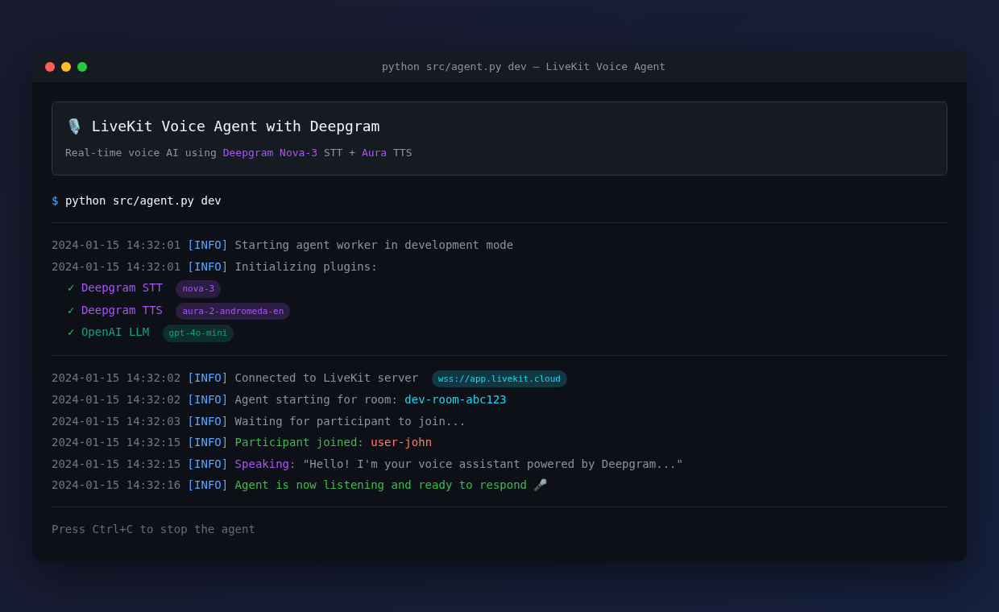

# LiveKit Agents with Deepgram STT/TTS

Build real-time voice AI agents using LiveKit Agents framework with Deepgram's Nova-3 for speech-to-text and Aura for text-to-speech.



## Overview

This example demonstrates how to create a conversational voice assistant that:
- Listens to users with Deepgram Nova-3 speech recognition
- Responds with natural speech using Deepgram Aura TTS
- Uses OpenAI GPT-4o-mini for intelligent conversation
- Supports custom function tools for extended capabilities

## Prerequisites

- Python 3.10+
- [Deepgram account](https://console.deepgram.com/) with API key
- [OpenAI account](https://platform.openai.com/) with API key
- [LiveKit Cloud account](https://cloud.livekit.io/) or self-hosted LiveKit server

## Environment Variables

| Variable | Description |
|----------|-------------|
| `DEEPGRAM_API_KEY` | Your Deepgram API key for STT and TTS |
| `OPENAI_API_KEY` | Your OpenAI API key for the LLM |
| `LIVEKIT_URL` | LiveKit server WebSocket URL (e.g., `wss://your-app.livekit.cloud`) |
| `LIVEKIT_API_KEY` | LiveKit API key |
| `LIVEKIT_API_SECRET` | LiveKit API secret |

## Installation

```bash
# Create project directory and virtual environment
mkdir livekit-deepgram-agent
cd livekit-deepgram-agent
python -m venv venv
source venv/bin/activate  # or `venv\Scripts\activate` on Windows

# Install dependencies
pip install -r requirements.txt

# Copy and configure environment variables
cp .env.example .env
# Edit .env with your credentials
```

## Running the Agent

### Basic Voice Agent

Run the simple voice assistant without tools:

```bash
python src/agent.py dev
```

### Voice Agent with Tools

Run the voice assistant with time, weather, and calculator tools:

```bash
python src/agent_with_tools.py dev
```

The `dev` command starts the agent in development mode, which:
- Automatically reloads on code changes
- Starts the agent immediately without waiting for a job dispatch
- Creates a test room you can join

### Connecting to the Agent

Once the agent is running, you can connect using:

1. **LiveKit Meet** (easiest): Go to [meet.livekit.io](https://meet.livekit.io) and connect to your LiveKit room
2. **LiveKit CLI**: Use `lk room join` command
3. **Custom frontend**: Build a React/Next.js app with `@livekit/components-react`

## Project Structure

```
├── src/
│   ├── agent.py              # Basic voice assistant
│   └── agent_with_tools.py   # Voice assistant with function tools
├── tests/
│   ├── run_tests.py          # Main test runner
│   ├── test_deepgram_integration.py  # Deepgram API integration tests
│   └── test_tools.py         # Unit tests for function tools
├── requirements.txt          # Python dependencies
├── .env.example              # Environment variable template
└── README.md                 # This file
```

## How It Works

### Agent Configuration

The agent is configured with Deepgram for speech:

```python
from livekit.agents import Agent
from livekit.plugins import deepgram, openai

agent = Agent(
    instructions="You are a helpful voice assistant...",
    stt=deepgram.STT(
        model="nova-3",
        language="en-US",
        punctuate=True,
        smart_format=True,
    ),
    tts=deepgram.TTS(
        model="aura-2-andromeda-en",
        sample_rate=24000,
    ),
    llm=openai.LLM(model="gpt-4o-mini"),
)
```

### Function Tools

Add custom capabilities with function tools:

```python
from livekit.agents import llm
from typing import Annotated

@llm.function_tool
def get_weather(
    city: Annotated[str, "City name"]
) -> str:
    """Get weather for a city."""
    # Your implementation
    return f"Weather in {city}: 72°F, sunny"

# Add to agent
agent = Agent(
    # ... other config
    tools=[get_weather],
)
```

## Deepgram Models

### Speech-to-Text (Nova-3)

The example uses Deepgram's Nova-3 model for best-in-class speech recognition:
- Real-time streaming transcription
- Smart formatting and punctuation
- Filler word handling ("um", "uh")
- Multiple language support

### Text-to-Speech (Aura)

Deepgram Aura provides natural-sounding voices:
- `aura-2-andromeda-en` - Warm, professional female voice
- `aura-2-helios-en` - Confident male voice
- `aura-2-luna-en` - Friendly, conversational female voice

[See all available voices](https://developers.deepgram.com/docs/tts-models)

## Running Tests

```bash
# Run all tests
python tests/run_tests.py

# Run only unit tests
python tests/test_tools.py

# Run only integration tests (requires DEEPGRAM_API_KEY)
python tests/test_deepgram_integration.py
```

## Troubleshooting

### "Missing required environment variables"

Ensure all variables in `.env.example` are set in your `.env` file.

### "Connection error" from LiveKit

- Verify `LIVEKIT_URL` is correct (should start with `wss://`)
- Check that `LIVEKIT_API_KEY` and `LIVEKIT_API_SECRET` are valid
- Ensure your LiveKit server is running and accessible

### Audio quality issues

- Verify your microphone is working
- Check that no other application is using the microphone
- Try increasing `sample_rate` for TTS (default: 24000)

## What's Next

- Add more function tools (search, calendar, etc.)
- Implement conversation memory with chat context
- Connect to phone calls via SIP trunk
- Add multi-language support
- Deploy to production with LiveKit Cloud

## Resources

- [LiveKit Agents Documentation](https://docs.livekit.io/agents/)
- [Deepgram STT Documentation](https://developers.deepgram.com/docs/stt-streaming-feature-overview)
- [Deepgram TTS Documentation](https://developers.deepgram.com/docs/text-to-speech)
- [Deepgram Voice Models](https://developers.deepgram.com/docs/models-overview)
