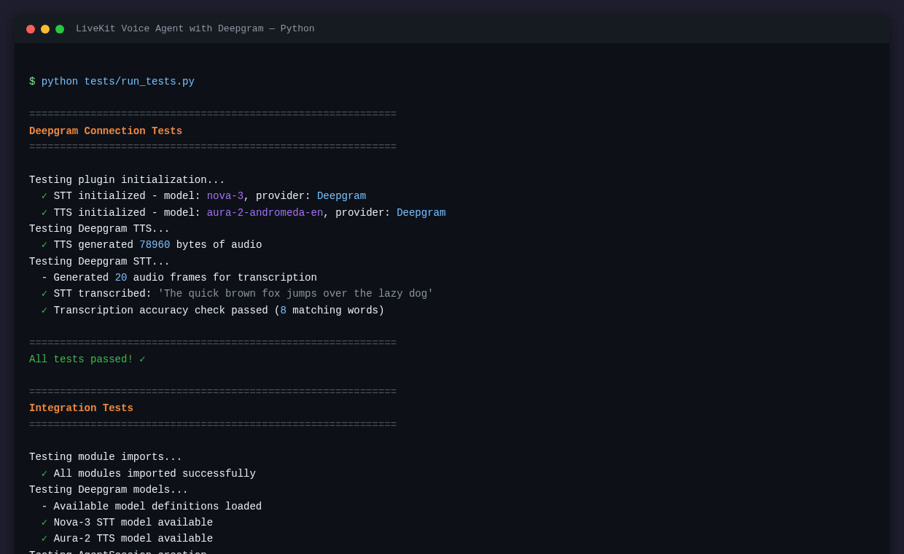

# LiveKit Voice Agent with Deepgram STT/TTS

A real-time voice AI agent using LiveKit Agents framework with Deepgram for speech-to-text and text-to-speech.



## What This Does

This example creates a voice-based AI assistant that:
- Joins a LiveKit room and listens for user speech
- Uses **Deepgram Nova-3** for real-time speech recognition
- Processes user input with **OpenAI GPT-4o-mini** (configurable)
- Responds with natural voice using **Deepgram Aura-2** text-to-speech
- Handles turn-taking and interruptions automatically

## Prerequisites

- Python 3.10+
- A [Deepgram account](https://console.deepgram.com/) with API key
- A [LiveKit Cloud account](https://cloud.livekit.io/) or self-hosted LiveKit server
- An [OpenAI account](https://platform.openai.com/) with API key

## Environment Variables

| Variable | Description |
|----------|-------------|
| `DEEPGRAM_API_KEY` | Your Deepgram API key for STT and TTS |
| `LIVEKIT_URL` | LiveKit server WebSocket URL (e.g., `wss://your-app.livekit.cloud`) |
| `LIVEKIT_API_KEY` | LiveKit API key |
| `LIVEKIT_API_SECRET` | LiveKit API secret |
| `OPENAI_API_KEY` | OpenAI API key for the LLM |

## Quick Start

1. **Clone and navigate to the example:**
   ```bash
   cd examples/540-livekit-voice-agent-python
   ```

2. **Create a virtual environment:**
   ```bash
   python -m venv venv
   source venv/bin/activate  # On Windows: venv\Scripts\activate
   ```

3. **Install dependencies:**
   ```bash
   pip install -r requirements.txt
   ```

4. **Configure environment variables:**
   ```bash
   cp .env.example .env
   # Edit .env with your API keys
   ```

5. **Run the agent in development mode:**
   ```bash
   python src/agent.py dev
   ```

6. **Connect to the agent:**
   - Open the [LiveKit Playground](https://agents-playground.livekit.io/)
   - Enter your LiveKit URL
   - Click "Connect" to join the same room as the agent
   - Start speaking!

## How It Works

The agent uses the LiveKit Agents framework pipeline:

```
User Speech → Deepgram STT → OpenAI LLM → Deepgram TTS → Audio Output
                  ↑                              ↓
              (Nova-3)                      (Aura-2)
```

1. **Voice Activity Detection (VAD)**: Silero VAD detects when the user starts/stops speaking
2. **Speech-to-Text**: Deepgram Nova-3 transcribes user speech in real-time
3. **LLM Processing**: OpenAI generates a response based on conversation history
4. **Text-to-Speech**: Deepgram Aura-2 synthesizes natural-sounding audio
5. **Turn Management**: LiveKit Agents handles interruptions and turn-taking

## Running in Production

For production deployment:

```bash
python src/agent.py start
```

This registers the agent with your LiveKit server so it can be dispatched to rooms automatically.

## Configuration Options

### Deepgram STT Options

```python
deepgram.STT(
    model="nova-3",           # Latest Deepgram model
    language="en-US",         # Language code
    interim_results=True,     # Enable partial transcripts
    punctuate=True,           # Add punctuation
    filler_words=True,        # Include um, uh, etc.
    endpointing_ms=25,        # Silence detection threshold
)
```

### Deepgram TTS Options

```python
deepgram.TTS(
    model="aura-2-andromeda-en",  # Voice model
    sample_rate=24000,             # Audio sample rate
)
```

### Available Deepgram TTS Voices

- `aura-2-andromeda-en` - Female, American English
- `aura-2-orion-en` - Male, American English
- `aura-2-luna-en` - Female, American English (conversational)
- `aura-2-stella-en` - Female, British English
- `aura-2-athena-en` - Female, British English

## Testing

Run the test suite:

```bash
python tests/run_tests.py
```

Tests verify:
- Deepgram STT connection and transcription
- Deepgram TTS connection and audio generation
- Plugin initialization
- Agent module structure

## Troubleshooting

### "Connection error" on startup
- Verify your `DEEPGRAM_API_KEY` is correct
- Check your internet connection
- Ensure the API key has STT and TTS permissions

### Agent doesn't respond to speech
- Check that your microphone is working in the LiveKit Playground
- Verify the VAD is detecting speech (check console logs)
- Ensure `OPENAI_API_KEY` is set correctly

### Audio quality issues
- Try adjusting `sample_rate` in TTS settings
- Check your network latency to LiveKit server

## Resources

- [LiveKit Agents Documentation](https://docs.livekit.io/agents/)
- [Deepgram Documentation](https://developers.deepgram.com/)
- [LiveKit Deepgram Plugin](https://github.com/livekit/agents/tree/main/livekit-plugins/livekit-plugins-deepgram)
